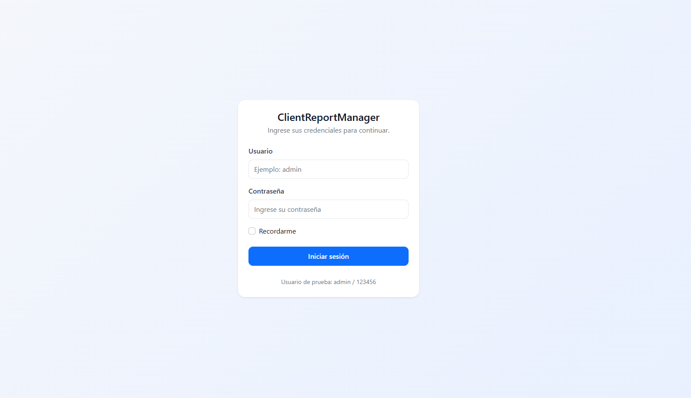
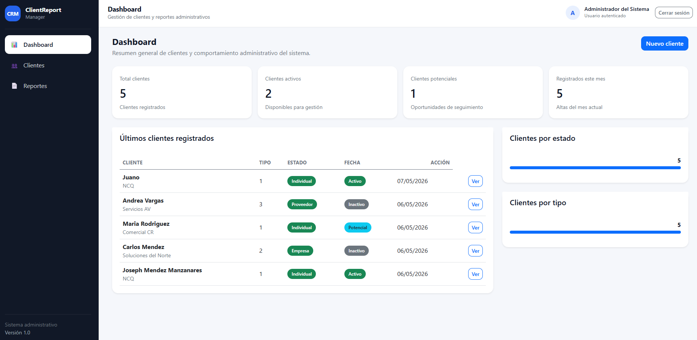
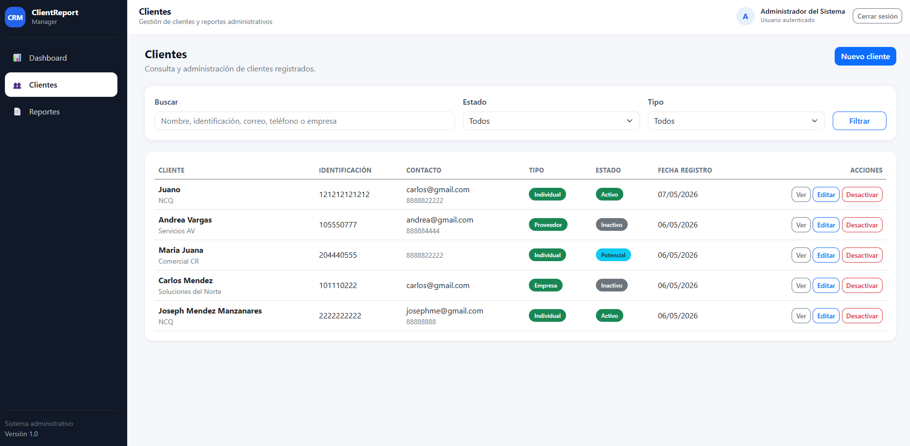
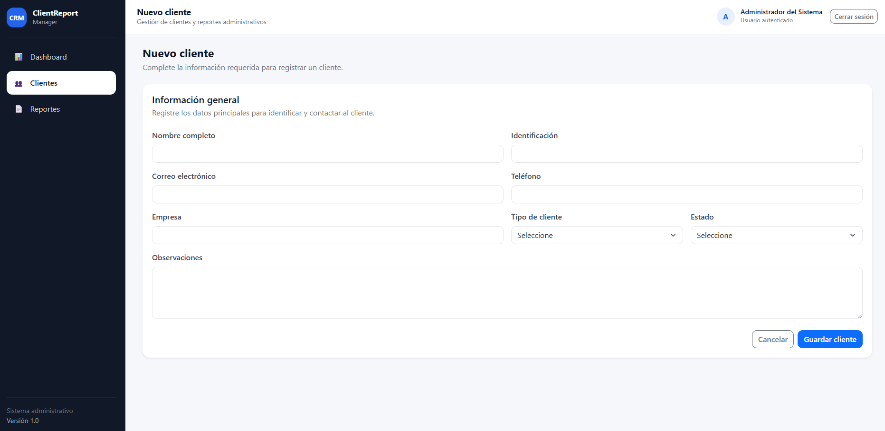
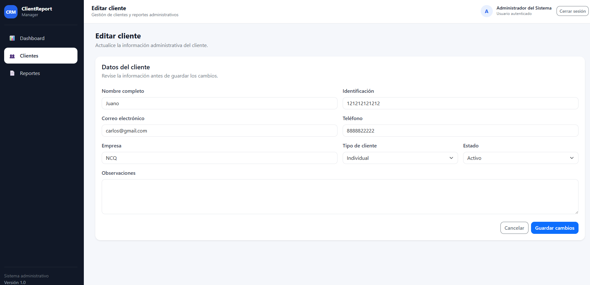
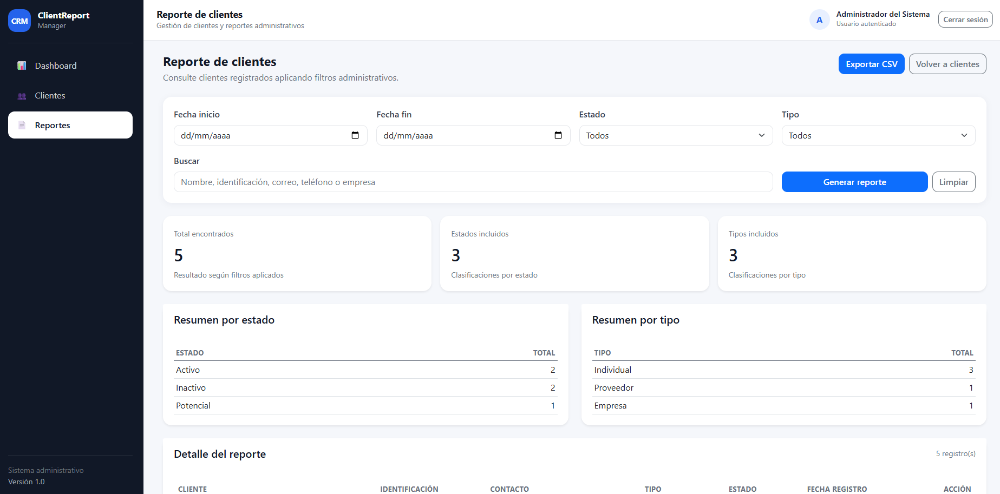
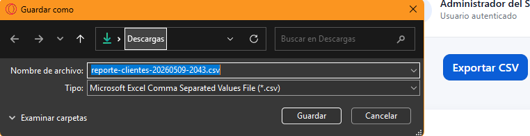

# ClientReport Manager

Sistema web administrativo para la gestión de clientes, dashboard, reportes y exportación CSV, desarrollado con ASP.NET Core MVC, C#, Entity Framework Core y SQL Server.

---

## Tabla de contenido

- [Descripción del proyecto](#descripción-del-proyecto)
- [Objetivo del sistema](#objetivo-del-sistema)
- [Problema que resuelve](#problema-que-resuelve)
- [Tecnologías utilizadas](#tecnologías-utilizadas)
- [Funcionalidades principales](#funcionalidades-principales)
- [Arquitectura del proyecto](#arquitectura-del-proyecto)
- [Estructura de carpetas](#estructura-de-carpetas)
- [Capturas del sistema](#capturas-del-sistema)
- [Requisitos previos](#requisitos-previos)
- [Configuración del entorno local](#configuración-del-entorno-local)
- [Ejecución del proyecto](#ejecución-del-proyecto)
- [Usuario de prueba](#usuario-de-prueba)
- [Base de datos](#base-de-datos)
- [Decisiones técnicas aplicadas](#decisiones-técnicas-aplicadas)
- [Checklist de pruebas](#checklist-de-pruebas)
- [Posibles mejoras futuras](#posibles-mejoras-futuras)
- [Autor](#autor)

---

## Descripción del proyecto

**ClientReport Manager** es una aplicación web administrativa desarrollada con **ASP.NET Core MVC**, **C#**, **Entity Framework Core** y **SQL Server**.

El sistema permite centralizar la información de clientes, administrar registros, consultar datos mediante filtros, visualizar métricas principales en un dashboard y generar reportes administrativos exportables en formato CSV.

El proyecto fue desarrollado como una práctica integral de desarrollo web con .NET, aplicando conceptos como:

- Arquitectura MVC.
- Programación orientada a objetos.
- Entity Framework Core.
- SQL Server.
- Servicios e interfaces.
- Inyección de dependencias.
- ViewModels.
- Validaciones.
- Autenticación básica.
- Reportes administrativos.
- Exportación de datos.
- Experiencia de usuario con Bootstrap y CSS personalizado.

Este proyecto simula una solución empresarial básica, pensada para reforzar conocimientos técnicos y demostrar habilidades de desarrollo full stack con tecnologías .NET.

---

## Objetivo del sistema

El objetivo principal de este proyecto es desarrollar un sistema web que permita gestionar clientes y generar reportes administrativos de forma centralizada, reduciendo la dependencia de archivos manuales como hojas de cálculo o documentos separados.

El sistema busca permitir que un usuario administrativo pueda:

- Registrar clientes.
- Consultar información rápidamente.
- Aplicar filtros.
- Visualizar métricas generales.
- Generar reportes.
- Exportar resultados.
- Administrar la información desde una interfaz web clara y ordenada.

---

## Problema que resuelve

En muchas empresas pequeñas o medianas, la información de clientes se administra mediante Excel, correos, documentos compartidos o registros manuales. Esto puede generar problemas como:

- Duplicidad de datos.
- Pérdida de información.
- Dificultad para buscar clientes.
- Falta de reportes.
- Poca trazabilidad.
- Procesos manuales lentos.
- Errores al consolidar información.

**ClientReport Manager** propone una solución web centralizada que permite administrar clientes desde una base de datos relacional, consultar información mediante filtros y obtener reportes útiles para la toma de decisiones.

---

## Tecnologías utilizadas

| Área | Tecnología |
|---|---|
| Backend | ASP.NET Core MVC |
| Lenguaje | C# |
| Base de datos | SQL Server |
| ORM | Entity Framework Core |
| Frontend | HTML, CSS, JavaScript |
| Framework UI | Bootstrap |
| Autenticación | Cookies de ASP.NET Core |
| Seguridad de contraseña | PasswordHasher |
| IDE recomendado | Visual Studio 2022 |
| Control de versiones | Git / GitHub |
| Exportación | CSV compatible con Excel |

---

## Funcionalidades principales

### Autenticación

El sistema cuenta con un módulo de autenticación básico que permite proteger las pantallas internas.

Funcionalidades incluidas:

- Inicio de sesión.
- Cierre de sesión.
- Autenticación mediante cookies.
- Protección de controladores con `[Authorize]`.
- Redirección automática al login si el usuario no está autenticado.
- Manejo de contraseña con `PasswordHasher`.

---

### Gestión de clientes

El módulo de clientes permite administrar la información principal de cada cliente.

Funcionalidades incluidas:

- Registrar clientes.
- Editar clientes.
- Consultar detalle de cliente.
- Buscar clientes por texto.
- Filtrar clientes por estado.
- Filtrar clientes por tipo.
- Validar identificación duplicada.
- Desactivar clientes mediante desactivación lógica.

La desactivación lógica permite conservar el registro en base de datos, evitando eliminar información que podría ser necesaria para reportes o trazabilidad.

---

### Dashboard

El dashboard muestra una vista general del estado del sistema.

Indicadores incluidos:

- Total de clientes registrados.
- Clientes activos.
- Clientes inactivos.
- Clientes potenciales.
- Clientes registrados durante el mes actual.
- Últimos clientes registrados.
- Resumen por estado.
- Resumen por tipo.

Este módulo permite visualizar rápidamente información clave sin necesidad de generar un reporte completo.

---

### Reportes administrativos

El módulo de reportes permite consultar clientes mediante filtros combinados.

Filtros disponibles:

- Fecha de inicio.
- Fecha final.
- Estado del cliente.
- Tipo de cliente.
- Búsqueda por texto.

Resultados incluidos:

- Total de clientes encontrados.
- Resumen por estado.
- Resumen por tipo.
- Tabla detallada de clientes.
- Exportación CSV.

---

### Exportación CSV

El sistema permite exportar los resultados del reporte a un archivo CSV.

Características de la exportación:

- Respeta los filtros aplicados por el usuario.
- Utiliza punto y coma como separador para mejorar compatibilidad con Excel en configuración regional en español.
- Maneja caracteres especiales como comillas, punto y coma y saltos de línea.
- Genera el archivo sin almacenarlo físicamente en el servidor.

---

### Experiencia de usuario

Se trabajó una interfaz administrativa con enfoque en claridad y orden visual.

Mejoras aplicadas:

- Sidebar de navegación.
- Topbar con usuario autenticado.
- Tarjetas para métricas.
- Tablas limpias.
- Formularios ordenados.
- Badges para estados.
- Mensajes de éxito.
- Confirmaciones antes de acciones importantes.
- Diseño responsive básico.

---

## Arquitectura del proyecto

El proyecto utiliza el patrón **MVC** y una capa adicional de servicios para separar responsabilidades.

La arquitectura general es:

```text
Controller → Service → DbContext → Database
View       ← ViewModel ← Service
```

### Responsabilidad de cada capa

| Capa | Responsabilidad |
|---|---|
| Controllers | Reciben solicitudes del usuario y devuelven vistas |
| Services | Contienen lógica de negocio y consultas principales |
| Models | Representan entidades del sistema |
| ViewModels | Transportan datos específicos hacia las vistas |
| Data | Contiene el DbContext y configuración de base de datos |
| Views | Presentan la interfaz al usuario |
| wwwroot | Contiene CSS, JavaScript e imágenes |

---

## Estructura de carpetas

```text
ClientReportManager/
│
├── Controllers/
│   ├── AccountController.cs
│   ├── ClientesController.cs
│   ├── DashboardController.cs
│   └── ReportesController.cs
│
├── Data/
│   └── ApplicationDbContext.cs
│
├── Models/
│   ├── Cliente.cs
│   ├── EstadoCliente.cs
│   ├── TipoCliente.cs
│   └── Usuario.cs
│
├── Services/
│   ├── IClienteService.cs
│   ├── ClienteService.cs
│   ├── IDashboardService.cs
│   ├── DashboardService.cs
│   ├── IReporteService.cs
│   ├── ReporteService.cs
│   ├── IUsuarioService.cs
│   └── UsuarioService.cs
│
├── ViewModels/
│   ├── ClienteFiltroViewModel.cs
│   ├── DashboardViewModel.cs
│   ├── LoginViewModel.cs
│   └── ReporteClientesViewModel.cs
│
├── Views/
│   ├── Account/
│   ├── Clientes/
│   ├── Dashboard/
│   ├── Reportes/
│   └── Shared/
│
├── wwwroot/
│   ├── css/
│   ├── js/
│   └── lib/
│
├── docs/
│   └── screenshots/
│
├── appsettings.json
├── Program.cs
├── ClientReportManager.csproj
├── .gitignore
└── README.md
```

---

## Capturas del sistema

Las capturas deben guardarse dentro de la carpeta:

```text
docs/screenshots/
```

Se recomienda usar los siguientes nombres para mantener orden y claridad:

```text
docs/screenshots/01-login.png
docs/screenshots/02-dashboard.png
docs/screenshots/03-clientes.png
docs/screenshots/04-nuevo-cliente.png
docs/screenshots/05-editar-cliente.png
docs/screenshots/06-reportes.png
docs/screenshots/07-exportacion-csv.png
```

### 1. Login

Pantalla de inicio de sesión del sistema.



---

### 2. Dashboard

Pantalla principal con indicadores generales de clientes.



---

### 3. Gestión de clientes

Listado de clientes con búsqueda, filtros y acciones administrativas.



---

### 4. Registro de cliente

Formulario para registrar nuevos clientes.



---

### 5. Edición de cliente

Formulario para actualizar la información de un cliente existente.



---

### 6. Reportes administrativos

Pantalla de reportes con filtros, resúmenes y detalle.



---

### 7. Exportación CSV

Resultado del archivo CSV abierto en Excel.



---

## Requisitos previos

Para ejecutar este proyecto en un entorno local se necesita tener instalado:

- Visual Studio 2022.
- .NET 8 SDK.
- SQL Server.
- SQL Server Management Studio, opcional pero recomendado.
- Git.
- Entity Framework Core Tools.

---

## Configuración del entorno local

### 1. Clonar el repositorio

```bash
git clone URL_DEL_REPOSITORIO
```

Entrar a la carpeta del proyecto:

```bash
cd ClientReportManager
```

---

### 2. Restaurar paquetes NuGet

```bash
dotnet restore
```

---

### 3. Revisar la cadena de conexión

Abrir el archivo:

```text
appsettings.json
```

Verificar la sección:

```json
{
  "ConnectionStrings": {
    "DefaultConnection": "Server=localhost;Database=ClientReportManagerDb;Trusted_Connection=True;TrustServerCertificate=True;"
  }
}
```

Si se utiliza SQL Server Express, se puede usar:

```json
{
  "ConnectionStrings": {
    "DefaultConnection": "Server=localhost\\SQLEXPRESS;Database=ClientReportManagerDb;Trusted_Connection=True;TrustServerCertificate=True;"
  }
}
```

Si se utiliza un usuario SQL, la cadena puede variar según la configuración local.

Ejemplo:

```json
{
  "ConnectionStrings": {
    "DefaultConnection": "Server=localhost;Database=ClientReportManagerDb;User Id=sa;Password=TuClave;TrustServerCertificate=True;"
  }
}
```

Importante: no se recomienda subir credenciales reales al repositorio.

---

### 4. Instalar herramientas de Entity Framework Core

Si no se tienen instaladas las herramientas de EF Core, ejecutar:

```bash
dotnet tool install --global dotnet-ef
```

Si ya están instaladas, se pueden actualizar con:

```bash
dotnet tool update --global dotnet-ef
```

Verificar instalación:

```bash
dotnet ef
```

---

### 5. Aplicar migraciones

Ejecutar:

```bash
dotnet ef database update
```

Este comando creará la base de datos `ClientReportManagerDb` y las tablas necesarias.

---

### 6. Compilar el proyecto

```bash
dotnet build
```

Si todo está correcto, debe mostrarse un resultado similar a:

```text
Build succeeded.
```

---

### 7. Ejecutar el proyecto

```bash
dotnet run
```

Luego abrir en el navegador la URL indicada por la consola.

Ejemplo:

```text
https://localhost:5001
```

o

```text
http://localhost:5000
```

También se puede ejecutar directamente desde Visual Studio 2022 presionando:

```text
Ctrl + F5
```

---

## Ejecución del proyecto desde Visual Studio 2022

Otra forma de ejecutar el proyecto es mediante Visual Studio 2022.

Pasos:

1. Abrir Visual Studio 2022.
2. Seleccionar **Open a project or solution**.
3. Abrir el archivo:

```text
ClientReportManager.sln
```

4. Verificar la cadena de conexión en `appsettings.json`.
5. Abrir la consola de NuGet:

```text
Tools → NuGet Package Manager → Package Manager Console
```

6. Ejecutar:

```powershell
Update-Database
```

7. Ejecutar el proyecto con:

```text
Ctrl + F5
```

---

## Usuario de prueba

El sistema incluye un usuario inicial para pruebas:

```text
Usuario: admin
Contraseña: 123456
```

Después del primer inicio de sesión, la contraseña se actualiza automáticamente a formato hash utilizando `PasswordHasher`.

---

## Base de datos

El proyecto utiliza SQL Server y Entity Framework Core bajo el enfoque Code First.

Tablas principales:

```text
Clientes
EstadosCliente
TiposCliente
Usuarios
```

### Clientes

Tabla principal del sistema. Almacena la información administrativa de cada cliente.

Campos principales:

- IdCliente
- NombreCompleto
- Identificacion
- Correo
- Telefono
- Empresa
- IdTipoCliente
- IdEstadoCliente
- FechaRegistro
- Observaciones

### EstadosCliente

Catálogo de estados disponibles para los clientes.

Datos iniciales:

- Activo
- Inactivo
- Potencial

### TiposCliente

Catálogo de tipos de cliente.

Datos iniciales:

- Individual
- Empresa
- Proveedor
- Corporativo

### Usuarios

Tabla utilizada para el inicio de sesión.

Datos iniciales:

- admin / 123456

---

## Decisiones técnicas aplicadas

### Uso de MVC

El proyecto utiliza el patrón Model-View-Controller para separar responsabilidades.

- El modelo representa los datos.
- La vista presenta la interfaz.
- El controlador coordina las solicitudes del usuario.

---

### Uso de servicios

La lógica de negocio fue separada en servicios para evitar controladores demasiado cargados.

Ejemplo:

```text
ClientesController → coordina solicitudes
ClienteService     → contiene lógica de clientes
```

Esto permite que el código sea más ordenado, mantenible y fácil de extender.

---

### Uso de interfaces

Se utilizaron interfaces para desacoplar los controladores de las implementaciones concretas.

Ejemplo:

```csharp
public interface IClienteService
{
    Task<ClienteFiltroViewModel> ObtenerClientesAsync(
        string? buscar,
        int? idEstadoCliente,
        int? idTipoCliente
    );
}
```

Implementación:

```csharp
public class ClienteService : IClienteService
{
    // Implementación real de la lógica de clientes.
}
```

---

### Inyección de dependencias

Los servicios se registran en `Program.cs`:

```csharp
builder.Services.AddScoped<IClienteService, ClienteService>();
builder.Services.AddScoped<IDashboardService, DashboardService>();
builder.Services.AddScoped<IReporteService, ReporteService>();
builder.Services.AddScoped<IUsuarioService, UsuarioService>();
```

Esto permite que ASP.NET Core entregue automáticamente las dependencias a los controladores.

Ejemplo:

```csharp
public ClientesController(IClienteService clienteService)
{
    _clienteService = clienteService;
}
```

---

### Desactivación lógica

El sistema no elimina físicamente los clientes. En lugar de eso, los marca como inactivos.

Esto permite conservar información histórica y evita pérdida de datos.

---

### Filtro de fecha final

Para reportes por rango de fechas, se utiliza una fecha final exclusiva:

```csharp
var finExclusivo = fechaFin.Value.Date.AddDays(1);

query = query.Where(c => c.FechaRegistro < finExclusivo);
```

Esto permite incluir todos los registros del día final, sin depender de la hora exacta.

---

### Exportación CSV compatible con Excel

El archivo CSV se genera utilizando punto y coma como separador.

Esto mejora la compatibilidad con Excel en configuraciones regionales en español.

También se manejan caracteres especiales como:

- Punto y coma.
- Comillas.
- Saltos de línea.

---

### Seguridad básica

El sistema implementa autenticación mediante cookies y protege los controladores internos con `[Authorize]`.

También se utiliza `PasswordHasher` para evitar mantener contraseñas en texto plano.

---

## Checklist de pruebas

### Autenticación

| Prueba | Resultado esperado |
|---|---|
| Ingresar con usuario correcto | Acceso al dashboard |
| Ingresar con contraseña incorrecta | Mensaje genérico de error |
| Entrar a `/Clientes` sin sesión | Redirección al login |
| Cerrar sesión | Redirección al login |

---

### Clientes

| Prueba | Resultado esperado |
|---|---|
| Registrar cliente válido | Cliente guardado correctamente |
| Registrar cliente sin nombre | Muestra validación |
| Registrar cliente sin identificación | Muestra validación |
| Registrar identificación duplicada | Muestra error |
| Editar cliente | Datos actualizados |
| Desactivar cliente | Estado cambia a inactivo |
| Buscar cliente | Muestra coincidencias |
| Filtrar por estado | Muestra clientes del estado seleccionado |
| Filtrar por tipo | Muestra clientes del tipo seleccionado |

---

### Dashboard

| Prueba | Resultado esperado |
|---|---|
| Total de clientes | Coincide con registros existentes |
| Clientes activos | Coincide con estado activo |
| Clientes inactivos | Coincide con estado inactivo |
| Clientes potenciales | Coincide con estado potencial |
| Últimos clientes | Muestra clientes recientes |

---

### Reportes

| Prueba | Resultado esperado |
|---|---|
| Reporte sin filtros | Muestra todos los clientes |
| Filtro por fecha | Respeta el rango seleccionado |
| Filtro por estado | Muestra solo ese estado |
| Filtro por tipo | Muestra solo ese tipo |
| Búsqueda por texto | Muestra coincidencias |
| Fecha inicial mayor a fecha final | Muestra error |
| Exportar CSV | Descarga archivo correctamente |
| Exportar CSV con filtros | Descarga solo resultados filtrados |

---

## Posibles errores comunes

### Error de conexión a SQL Server

Verificar que SQL Server esté iniciado y que la cadena de conexión sea correcta.

---

### Error al ejecutar migraciones

Verificar que las herramientas de Entity Framework Core estén instaladas:

```bash
dotnet tool install --global dotnet-ef
```

También verificar que el proyecto compile:

```bash
dotnet build
```

---

### Error de certificado HTTPS

Si el navegador muestra advertencias de certificado en ambiente local, ejecutar:

```bash
dotnet dev-certs https --trust
```

---

### No aparece la base de datos

Ejecutar nuevamente:

```bash
dotnet ef database update
```

---

### El usuario admin no puede iniciar sesión

Verificar que la migración haya insertado el usuario inicial.

También se puede consultar la tabla `Usuarios` desde SQL Server Management Studio.

---

## Posibles mejoras futuras

- Implementar roles y permisos.
- Agregar auditoría de acciones.
- Agregar paginación en tablas.
- Agregar ordenamiento dinámico en listados.
- Exportar reportes a Excel real.
- Exportar reportes a PDF.
- Agregar gráficos con Chart.js.
- Implementar pruebas unitarias.
- Agregar logs de errores.
- Publicar en Azure App Service.
- Crear una API REST.
- Separar frontend y backend.
- Implementar recuperación de contraseña.
- Migrar autenticación a ASP.NET Core Identity.
- Agregar modo oscuro.
- Agregar historial de cambios por cliente.

---

## Qué demuestra este proyecto

Este proyecto demuestra conocimientos prácticos en:

- Desarrollo web con ASP.NET Core MVC.
- Programación en C#.
- Programación orientada a objetos.
- Entity Framework Core.
- SQL Server.
- Arquitectura MVC.
- Servicios e interfaces.
- Inyección de dependencias.
- Validaciones.
- Autenticación básica.
- Reportes administrativos.
- Exportación de datos.
- Diseño de interfaz con Bootstrap.
- Buenas prácticas de organización de código.

---

## Autor

Proyecto desarrollado como práctica profesional de desarrollo web con .NET, enfocado en sistemas administrativos, reportes, seguridad básica, arquitectura MVC y experiencia de usuario.

---

## Estado del proyecto

Proyecto funcional en versión inicial.

Actualmente incluye:

- Login.
- Dashboard.
- Gestión de clientes.
- Reportes.
- Exportación CSV.
- Validaciones.
- Interfaz administrativa.

Se mantiene abierto para futuras mejoras técnicas y funcionales.